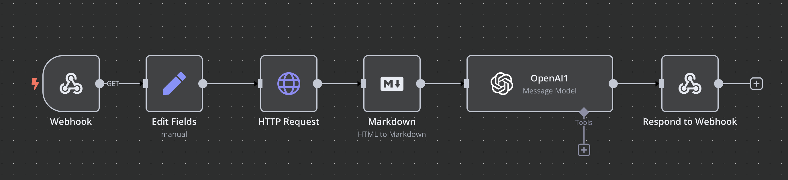

# Harry Potter House Sorting Game

A Flutter app for guessing Hogwarts houses of Harry Potter characters with dynamic image loading and progress tracking.

## Features

- [x] Character-based house guessing gameplay
- [x] Dynamic character image loading
- [x] Progress tracking with success/fail statistics
- [x] List view of attempted characters
- [x] Pull-to-refresh for new characters
- [x] State persistence across game sessions

## Demo


## App Architecture

The app follows a clean architecture pattern with three main layers:

### Data Layer
- `HttpService` for handling API requests to fetch characters and images
- Character data models with Freezed for immutability

### Domain Layer
- Game logic and state management using Riverpod
- Character randomization and scoring system
- Image loading and caching mechanisms

### Presentation Layer
- Main game screen with house selection
- Character list screen showing attempt history
- Statistics cards showing game progress
- Responsive UI with loading states

## State Management

The app uses Riverpod for state management with the following key components:

- `MainPageController` for overall game state
- `ListScreenController` for attempted characters list
- Async state handling for image loading
- Persistent state across screen transitions

## Image

The app fetches character images dynamically using n8n as an automation tool to process and serve images via API. The workflow in n8n retrieves images from external sources and delivers optimized URLs to the app.


## Getting Started

1. Clone the repository

```bash
git clone https://github.com/23Andrii23/hogwarts-sorting-game.git
```

2. Install dependencies

```bash
flutter pub get
```

3. Run the app

```bash
flutter run
```

## Contributing
Contributions are welcome! Please feel free to submit a Pull Request.